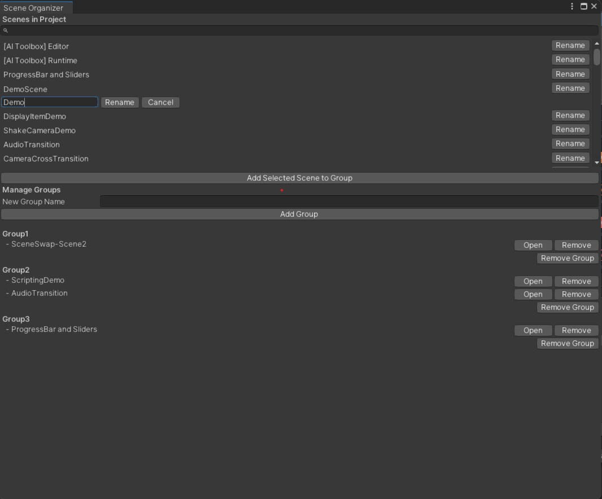

## Made entirely with ChatGPT
### No code was written by me

This code defines a custom Unity Editor window called "Scene Organizer," which allows users to manage and organize scenes in a Unity project. Below is a detailed explanation of the code and its features:

### Explanation by ChatGPT

1. **Namespace Imports**:
   - `using UnityEditor;`
   - `using UnityEngine;`
   - `using System;`
   - `using System.Collections.Generic;`
   - `using System.IO;`
   - `using System.Runtime.Serialization.Formatters.Binary;`
   - `using UnityEditor.SceneManagement;`

   These namespaces are required for accessing Unity Editor functionalities, handling UI elements, and working with files and serialization.

2. **Class Definition**:
   - `public class SceneOrganizerWindow : EditorWindow`
   This defines a new class `SceneOrganizerWindow` that inherits from `EditorWindow`, making it a custom Unity Editor window.

3. **Variables**:
   - Various variables are defined to manage scenes, groups, UI states, and configurations.

4. **Menu Item**:
   - `[MenuItem("Window/Scene Organizer")]`
   - `public static void ShowWindow()`
   This creates a menu item in the Unity Editor under "Window" named "Scene Organizer". When clicked, it opens the custom editor window.

5. **OnEnable and OnDisable Methods**:
   - `private void OnEnable()`
   - `private void OnDisable()`
   These methods load scenes and groups when the window is enabled and save groups when the window is disabled.

6. **Path Management**:
   - `private void EnsureSavePathExists()`
   This ensures that the directory for saving group data exists.

7. **Scene and Group Management**:
   - `private void LoadScenes()`
   - `private void SaveGroups()`
   - `private void LoadGroups()`
   These methods handle loading and saving scenes and groups using serialization.

8. **GUI Rendering**:
   - `private void OnGUI()`
   This method defines the layout and interactions within the custom editor window.

### Features

1. **Scene List Display**:
   - Displays a list of all scenes in the project.
   - Supports searching through scenes using a search bar.

2. **Scene Selection and Highlighting**:
   - Allows selecting a scene from the list.
   - Highlights the selected scene.

3. **Double-Click to Open Scene**:
   - Double-clicking a scene in the list opens it in the editor.

4. **Drag-and-Drop Scenes to Groups**:
   - Supports dragging scenes from the list and dropping them into groups.

5. **Resizeable UI Areas**:
   - The scene list and group list areas are resizeable using a handle.

6. **Group Management**:
   - Allows creating new groups.
   - Displays existing groups and the scenes within them.
   - Supports adding selected scenes to groups.
   - Allows removing scenes from groups.
   - Allows removing entire groups.

7. **Scene Renaming**:
   - Provides functionality to rename scenes within the project.

### GUI Methods

1. **DrawSearchBar**:
   - Renders a search bar to filter the scene list.

2. **DrawScenesList**:
   - Renders the list of scenes with search functionality and renaming options.

3. **DrawSceneItem**:
   - Helper method to render each scene item with appropriate UI elements.

4. **DrawRenameSceneField**:
   - Renders the text field and buttons for renaming a scene.

5. **DrawSceneLabel**:
   - Renders the scene label and handles selection and highlighting.

6. **DrawResizeHandle**:
   - Renders a handle for resizing the scene and group areas.

7. **DrawAddSceneToGroupButton**:
   - Renders a button to add the selected scene to a group.

8. **DrawNewGroupSection**:
   - Renders the UI elements for creating a new group.

9. **DrawGroupSection**:
   - Renders the list of groups and the scenes within each group.

### Scene Operations

1. **RenameScene**:
   - Handles renaming a scene asset within the project.

2. **AddNewGroup**:
   - Adds a new group to the group dictionary.

3. **AddSceneToGroup**:
   - Adds a scene to a specified group.

4. **OpenScene**:
   - Opens the specified scene in the editor.

### Event Handling

1. **HandleDragAndDrop**:
   - Manages the drag-and-drop functionality for scenes and groups.

2. **HandleSceneSelection**:
   - Handles the logic for selecting and highlighting scenes, as well as double-click to open scenes.

This code provides a comprehensive tool for organizing scenes in a Unity project, with features for grouping, renaming, and managing scenes in an intuitive editor window interface.
